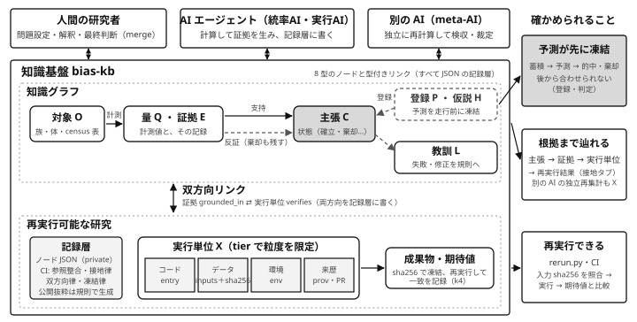

# bias-kb Atlas — 公開抜粋（主張から再実行可能な証拠へ）

[](https://github.com/jxta/bias-kb-atlas/actions/workflows/rerun.yml)
[](https://mybinder.org/v2/gh/jxta/bias-kb-atlas/main?urlpath=lab/tree/README.md)
[](https://codespaces.new/jxta/bias-kb-atlas?quickstart=1)

**閲覧**: https://jxta.github.io/bias-kb-atlas/ （静的ページ。ローカルで見るときは `python3 -m http.server` でこのディレクトリを配信して `index.html` を開く。外部依存は d3 v7.9.0 を jsDelivr から SRI 付きで読むだけ）

これは、素数の偏り（Chebyshev bias）の系統的研究を複数の AI エージェントと人間で進めている
知識基盤 **bias-kb**（private リポジトリ `jxta/ai4math-lab` の `knowledge/`）から、
**「主張 → 証拠 → 再実行可能な実行単位」の鎖**に関わるノードを規則で抜き出した公開版です。
記録層 853 ノード（2026-09-06、commit `593ef1e`）中 100 ノード（関数体 census 線と Q8 の W 層）。抜き出し規則は生成器
`kb_atlas.py --profile public-grounding`（private 側 `knowledge/tools/`）に書かれており、手では選んでいません。
抜粋外の隣接ノードは**型だけの非公開スタブ**（68 件、ID は実 ID の sha256 先頭 10 桁）として残し、
「証拠・主張はあるが非公開」と「根拠がない」を区別できるようにしています。

## 何を示すためのものか

この知識基盤の設計目標は、**主張を、それを生んだ再実行可能な計算に双方向のリンクで接地させ、推論が常に再実行可能な証拠まで遡れるようにする**ことです。
それが進行中の研究で実際に動いていることを、閲覧者自身（人でも、別の AI でも）が確かめられるようにしています。

## しくみ — 図と実例の対応

下の図は、この知識基盤のしくみを一枚にしたものです。Atlas の最初のタブ **「案内」** に同じ図と対応表があり、
図の要素をクリック（キーボードでも選べます）すると実例のノードが開きます（https://jxta.github.io/bias-kb-atlas/#v=guide ）。

<p align="center"></p>

| 図の要素 | この知識基盤での実体 | 実例（Atlas で開く） |
|---|---|---|
| **人間の研究者**（問題設定・解釈・最終判断） | 問題設定は指示書（ORDER）と実行前登録に、最終判断は PR の merge に置く（merge は人間だけが行い、AI は merge しない）。詳細パネルの「来歴」に PR 番号と承認者 | [P-o19-registration](https://jxta.github.io/bias-kb-atlas/#v=guide&node=P-o19-registration) |
| **AI エージェント**（統率AI・実行AI） | 実行AI が計算して証拠を生み、統率AI が記録層にノードを書いて主張を立てる。誰が書いたかは `prov.asserted_by` | [X-census-d17](https://jxta.github.io/bias-kb-atlas/#v=guide&node=X-census-d17) → [E-census-d17](https://jxta.github.io/bias-kb-atlas/#v=guide&node=E-census-d17) → [C-1q-law](https://jxta.github.io/bias-kb-atlas/#v=guide&node=C-1q-law) |
| **別の AI**（meta-AI） | 記録層だけを読んで独立に再計算・再集計し、検収と裁定を行う。その再計算も実行単位 X として残る | [X-q8-crosstab-accept](https://jxta.github.io/bias-kb-atlas/#v=guide&node=X-q8-crosstab-accept) |
| **知識グラフ** | 8 型のノード（O 対象・Q 量・E 証拠・C 主張・H 仮説・P 登録・X 実行単位・L 教訓）と型付きリンク。CI が参照整合・接地律・双方向律・凍結律を検査 | [俯瞰](https://jxta.github.io/bias-kb-atlas/#v=atlas)・[グラフ](https://jxta.github.io/bias-kb-atlas/#v=graph) |
| 対象 O | 計測の対象（族・体・census 表）。実例: 数体 Q8（8T5）の全数族 | [O-nf-q8-8t5](https://jxta.github.io/bias-kb-atlas/#v=guide&node=O-nf-q8-8t5) |
| 計測 → 量 Q・証拠 E | 計測される量（関数等式符号 W、中心零点位数 m）と、その記録。E は `quantities` で Q を、`about` で対象を指す | [Q-root-number](https://jxta.github.io/bias-kb-atlas/#v=guide&node=Q-root-number)、[E-q8-w-crosstab](https://jxta.github.io/bias-kb-atlas/#v=guide&node=E-q8-w-crosstab) |
| 支持 → **主張 C** | `supported_by` で証拠を指し、状態を持つ。実例: Q8 の解析済 40,125 体で「中心消滅 ⇔ W=−1」（完全対角）— 走行前に凍結した予測どおりの的中で `registered-hit` | [C-q8-w-diagonal](https://jxta.github.io/bias-kb-atlas/#v=grounding&node=C-q8-w-diagonal)、[C-1q-law](https://jxta.github.io/bias-kb-atlas/#v=grounding&node=C-1q-law) |
| 反証（棄却も残す） | `refuted_by` で結び、主張は `rejected` のまま残す。実例: 中央係数則は e=10 の直接計算 −6024 ≠ −5880 で自己反証し、教訓に昇格 | [C-middle-law-false](https://jxta.github.io/bias-kb-atlas/#v=grounding&node=C-middle-law-false)、[E-middle-e10](https://jxta.github.io/bias-kb-atlas/#v=guide&node=E-middle-e10) |
| 登録 P・仮説 H（予測を走行前に凍結） | 判定帯まで走行前に凍結する事前登録（ファイルの sha256 で凍結）と仮説。予想は後から合わせられない形で先に書く | [P-q8-step2-w1](https://jxta.github.io/bias-kb-atlas/#v=guide&node=P-q8-step2-w1)、[H-d19-registered](https://jxta.github.io/bias-kb-atlas/#v=guide&node=H-d19-registered) |
| 教訓 L | 失敗や修正を規則に昇格させたもの（`taught_by` で元の証拠を指す） | [L-middle-law-self-refutation](https://jxta.github.io/bias-kb-atlas/#v=guide&node=L-middle-law-self-refutation)、[教訓](https://jxta.github.io/bias-kb-atlas/#v=lessons) |
| **双方向リンク** | 証拠 `grounded_in` ⇄ 実行単位 `verifies` を記録層に両方向で書く。主張 ⇄ 証拠の逆向きは CI が `backlinks.json` に導出し「双方向律」で照合。詳細パネルの ⇄ 印、`kb/backlinks.json` の `bidir` | [E-census-d17](https://jxta.github.io/bias-kb-atlas/#v=grounding&node=E-census-d17) ⇄ [X-census-d17-spot](https://jxta.github.io/bias-kb-atlas/#v=grounding&node=X-census-d17-spot) |
| **実行単位 X**（コード・データ・環境・来歴） | `entry`（コード＝1 コマンド）・`inputs` の sha256（データ）・`env`（環境）・`prov`（来歴）。`tier`（full／accept／spot）で再実行の範囲とコストを限定 | [X-census-d17-spot](https://jxta.github.io/bias-kb-atlas/#v=grounding&node=X-census-d17-spot)（詳細パネルの「再実行」枠） |
| 成果物・期待値 | sha256 で凍結し、再実行して一致を記録（k4） | [X-census-d17-spot](https://jxta.github.io/bias-kb-atlas/#v=grounding&node=X-census-d17-spot) |
| 記録層 | ノード JSON（private リポジトリ）。公開抜粋は規則で生成し、手で選ばない | `kb/nodes.json`、[表](https://jxta.github.io/bias-kb-atlas/#v=table) |
| **再実行できる** | `rerun.py` が入力 sha256 を照合し `entry` を実行して `expected` と比較。CI が push ごと・毎週に実行し、結果を `kb/rerun-latest.json` に書く（Atlas のヘッダ「最終再実行」） | [Actions](https://github.com/jxta/bias-kb-atlas/actions/workflows/rerun.yml)、下の「再実行する」 |
| **根拠まで辿れる** | 「接地」タブ: 主張 → 証拠 → 実行単位 → 再実行結果を 1 行で。「辿る」で根拠の鎖（登録 → 主張 → 証拠 → 実行 → 教訓）。KPI は「構造接地率」（鎖が書かれている）と「再実行一致」（実際に再実行して一致した）を分けて出す | [接地](https://jxta.github.io/bias-kb-atlas/#v=grounding) |
| **予測が先に凍結**（蓄積 → 予測 → 的中・棄却） | 蓄積（d=11〜17 の census）から d=19 の「境界超過の符号反転」を予測し、判定帯を走行前に登録 → 本走 → 帯内で的中（`registered-hit`）。抜粋内の登録的中 5 件 | [C-d19-sign-reversal](https://jxta.github.io/bias-kb-atlas/#v=grounding&node=C-d19-sign-reversal)、[登録・判定](https://jxta.github.io/bias-kb-atlas/#v=protocols) |

**３分で確かめる**（案内タブではツアー形式 — 進み具合・コマンドのコピー・期待出力つき）: (1) [接地タブ](https://jxta.github.io/bias-kb-atlas/#v=grounding)で `C-1q-law` の行 — 証拠 4 件と実行単位、再実行 PASS。(2) [X-census-d17-spot](https://jxta.github.io/bias-kb-atlas/#v=grounding&node=X-census-d17-spot) の「再実行」枠のコマンドを手元で走らせる（下の「再実行する」。手元に Python が無ければ上の Binder／Codespaces バッジ）。(3) [C-d19-sign-reversal](https://jxta.github.io/bias-kb-atlas/#v=grounding&node=C-d19-sign-reversal) の根拠の鎖に、実行前登録 → 本走 → 的中が並ぶ。(4) [C-middle-law-false](https://jxta.github.io/bias-kb-atlas/#v=grounding&node=C-middle-law-false) — 反例で棄却された主張も消えていない。(5) 詳細パネル「来歴」の主張者・承認者・PR 番号 — 記録層への反映は merge（人間の承認）だけで起きる。

| 原理 | KB での実装 | このリポジトリで確かめる方法 |
|---|---|---|
| **P1 計算接地** | 主張 `supported_by` → 証拠 `grounded_in` → 実行単位（`entry` コマンド・`inputs` の sha256・`expected`・`env`）。CI の R9 検査「接地律」が、証拠のない主張・実行単位のない証拠を拒否 | Atlas の「接地」タブ。主張ごとに証拠 → 実行単位 → 再実行結果を一覧し、「辿る」で詳細へ。JS なしなら `n/<id>.html` の「根拠の鎖」 |
| **P2 双方向性** | 証拠 `grounded_in` ⇄ 実行単位 `verifies` は記録層に両方向で書く。主張 ⇄ 証拠の逆向きは `backlinks.json` を CI が導出し「双方向律」で照合 | 詳細パネルの「出るリンク／入るリンク」。⇄ 印は記録層に両方向あるもの。機械可読には `kb/backlinks.json`（各リンクに `bidir`） |
| **P3 実行粒度** | 実行単位は `tier`（full = 本走・accept = 受入・spot = 抽出照合）で再実行の範囲とコストを限定 | offline 単位 7 本は同梱データだけで 1 コマンドずつ再実行できる（下記）。本走（full）は「非公開・未再実行」として別枠に正直に数える |

## 機械可読の入口 — For AI agents（英語）

The whole excerpt is reachable without JavaScript and without scraping the interactive page:

| 入口 | 何が取れるか |
|---|---|
| [`llms.txt`](https://jxta.github.io/bias-kb-atlas/llms.txt) | この抜粋の説明、グラフの歩き方（型・リンク・接地の鎖・スタブの読み方）、再実行の入口 |
| [`n/<id>.html`](https://jxta.github.io/bias-kb-atlas/n/C-1q-law.html) ／ [`n/<id>.json`](https://jxta.github.io/bias-kb-atlas/n/C-1q-law.json) | ノード単体の静的ページと JSON-LD（型・状態・本文・リンク（`bidir`・`stub` 付き）・根拠の鎖・再実行結果・来歴）。論文や別の AI から 1 ノードを URL で指せる。[一覧](https://jxta.github.io/bias-kb-atlas/n/index.html) |
| [`kb/kb.jsonld`](https://jxta.github.io/bias-kb-atlas/kb/kb.jsonld) | 抜粋全体の JSON-LD（context 同梱。`@graph` は記録層のノードそのまま＋スタブ） |
| [`kb/nodes.json`](https://jxta.github.io/bias-kb-atlas/kb/nodes.json) | Atlas が描く配列（派生情報 `_line` `_in` `_out` `_deg` `_stub` `_bundled` 付き） |
| [`kb/backlinks.json`](https://jxta.github.io/bias-kb-atlas/kb/backlinks.json) | 逆リンク表。各項目に `bidir`（記録層に逆向きも書かれているか）と `stub` |
| [`kb/schema.json`](https://jxta.github.io/bias-kb-atlas/kb/schema.json) ／ [`kb/context.jsonld`](https://jxta.github.io/bias-kb-atlas/kb/context.jsonld) | ノードの JSON Schema（2020-12）と JSON-LD context（来歴は W3C PROV に対応づけ） |
| [`kb/rerun-latest.json`](https://jxta.github.io/bias-kb-atlas/kb/rerun-latest.json) | CI が最後に offline 単位を再実行した結果（環境・commit・単位ごとの status/got/want） |
| [`sitemap.txt`](https://jxta.github.io/bias-kb-atlas/sitemap.txt) | 全ノードページの URL |

Walk: `C.supported_by → E.grounded_in → X` (and `X.verifies → E` written explicitly, so the pair is bidirectional). Refuted claims keep `status: rejected` and point to the counter-evidence via `refuted_by`; nothing is deleted. Ids of the form `<T>-~<10 hex>` with `"stub": true` are nodes that exist in the record layer but are outside this excerpt — only the type is public; they distinguish "evidence exists but is private" from "no evidence".

## 再実行する

```bash
git clone https://github.com/jxta/bias-kb-atlas.git && cd bias-kb-atlas
pip install -r requirements.txt      # sympy（閉形式の記号照合に使う）
python3 rerun.py                     # offline 単位: 入力の sha256 照合 → entry 実行 → expected と比較
python3 rerun.py X-census-d17-spot   # 1 単位だけ
```

期待される出力（2026-09-06、Python 3.12）:

```
X-a1-mobius            spot   PASS            A1_closedform_match: match / match
X-binom-band           spot   NOT-BUNDLED     (frozen input not bundled: subprojects/q8/data_node1/lmfdb_8T5_extended_v3.csv)
X-boundary-closedform  spot   PASS            closedform_vs_census(1/q law): match / match
X-census-d11-spot      spot   PASS            -0.49076650925398013 / -0.49076650925398013
X-census-d13-spot      spot   PASS            -0.4949126864583562 / -0.4949126864583562
X-census-d15-spot      spot   PASS            -0.4989715075302701 / -0.4989715075302701
X-census-d17-spot      spot   PASS            -0.4994337027369984 / -0.4994337027369984
X-q8-crosstab-accept   accept NOT-BUNDLED     (frozen input not bundled: subprojects/q8/data_node1/lmfdb_8T5_extended_v3.csv)
X-q8-ks                accept PASS            0 / 0

7/7 PASS (2 not bundled)
```

GitHub Actions（上のバッジ）が push のたびと毎週、同じ再実行を行い、結果を `kb/rerun-latest.json` に commit します（Atlas のヘッダ「最終再実行」と接地タブがそれを読みます）。
手元に Python が無ければ、Binder（ブラウザ内 JupyterLab）か GitHub Codespaces でこのリポジトリを開いて同じコマンドを実行できます。

`spot` 単位は凍結された集計ファイルから記録値を読み直すもの（記録と成果物の完全性の照合）、
`verify_*.py` は閉形式を sympy で記号的に再計算して census 実測と照合するものです。
`NOT-BUNDLED` は、記録層では offline とされているが凍結入力（54 MB の LMFDB 抽出 CSV）が大きすぎて同梱できない単位で、失敗ではなく集計から外しています。
本走（`full`、mdx 計算機上の全数 census: 例 d=17 は 86,093,442 個の指標）は同梱していません。
その本走の記録・sha・登録帯は各ノードの JSON にあり、Atlas では「非公開・未再実行」として一致にも不一致にも数えません。

## 中身

```
index.html                 Atlas（案内・接地・俯瞰・研究線・時間・グラフ・教訓・登録・表 ＋ 詳細パネル）
n/<id>.html, n/<id>.json   ノード単体の静的ページと JSON-LD（100 ノード）、n/index.html は一覧
kb/nodes.json              抜粋 100 ノード＋非公開スタブ 68 の記録（型・状態・リンク・来歴・凍結 sha・期待値）＋派生情報
kb/kb.jsonld               抜粋全体の JSON-LD（context 同梱）   kb/context.jsonld  JSON-LD context
kb/backlinks.json          逆リンク表（bidir・stub 付き）        kb/schema.json     ノードの JSON Schema
kb/rerun-latest.json       CI の最終再実行結果（CI が commit）
llms.txt, sitemap.txt      機械可読の入口
rerun.py                   offline 実行単位の再実行器（kb/nodes.json を読む）
subprojects/hurwitz_ea/    関数体 census の凍結集計 (d=11,13,15,17) と検証スクリプト 2 本
subprojects/q8_drh/...     D4 対照群 970 体の零点データ（Q8 KS 二側検定の入力）
docs/overview.svg          しくみの図（案内タブと上の対応表に使用）
.github/workflows/rerun.yml  再実行 CI（kb/rerun-latest.json を更新）
```

ノードの 8 型: O 対象・Q 量・E 証拠・C 主張・H 仮説・P 事前登録・X 実行単位・L 教訓。
状態: established／registered-hit（走行前に凍結した予測の的中）／supported／provisional／open／challenged／rejected（棄却も残す）。

## 出所と生成

- 記録層: `jxta/ai4math-lab`（private）`knowledge/` — 統率AI（Claude）が知識化し、meta-AI（Claude）が検収、横山（NII）が merge で承認。
- 生成: `knowledge/tools/kb_atlas.py --profile public-grounding --assets external --public-repo jxta/bias-kb-atlas --site-url https://jxta.github.io/bias-kb-atlas --bundle-inputs`（同リポジトリ）。すべて生成物で、手編集しない。鮮度（記録層のノード数・元 commit・同期日）は Atlas のヘッダに出る。
- 研究: JHPCN jh261018「AI for Science of Science: 系統的素数偏り研究」（青木美穂・島根大学、横山重俊・国立情報学研究所）。

*bias-kb Atlas public excerpt — claims grounded in re-executable evidence. Open `index.html`, read `llms.txt`, fetch one node as `n/<id>.json`, or run `python3 rerun.py` to re-execute the offline execution units bundled here and compare with the recorded expected values.*
